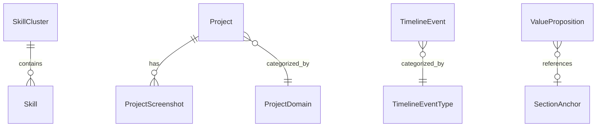

# Data Model: Portfolio Website Rebuild

**Branch**: `001-portfolio-rebuild`
**Date**: 2026-03-08

## Entity Overview



## Entities

### TimelineEvent

**File**: `src/types/timeline.ts` + `src/data/timelineEvents.ts`

| Field | Type | Required | Description |
|-------|------|----------|-------------|
| `id` | `string` | Yes | Unique identifier (kebab-case, e.g., `"senior-se-maqe"`) |
| `date` | `string` | Yes | Display date (e.g., `"2022 - Present"`, `"Mar 2023"`) |
| `sortDate` | `string` | Yes | ISO date for sorting (`"2022-01-01"`) |
| `title` | `string` | Yes | Event title (e.g., `"Senior Software Engineer"`) |
| `company` | `string` | Yes | Company or context (e.g., `"MAQE Bangkok"`) |
| `type` | `TimelineEventType` | Yes | Event category |
| `summary` | `string` | Yes | One-line summary for collapsed view (~80 chars) |
| `description` | `string` | Yes | Full narrative for expanded view (2–4 paragraphs) |
| `impact` | `string` | Yes | Concrete measurable impact statement |
| `skills` | `string[]` | Yes | Skills demonstrated or learned |
| `icon` | `string` | No | Lucide icon name override (default by type) |

**TimelineEventType** (string union):
`"work"` | `"project"` | `"education"` | `"achievement"`

**Type icon defaults**:
- `work` → `Briefcase`
- `project` → `Rocket`
- `education` → `GraduationCap`
- `achievement` → `Trophy`

**Validation rules**:
- `id` must be unique across all events
- `sortDate` must be valid ISO 8601 date string
- `skills` array must have ≥ 1 entry
- Events are rendered sorted by `sortDate` descending (newest first)

---

### Project

**File**: `src/types/project.ts` + `src/data/projects.ts`

| Field | Type | Required | Description |
|-------|------|----------|-------------|
| `slug` | `string` | Yes | URL slug for `/projects/[slug]` (kebab-case) |
| `title` | `string` | Yes | Project name |
| `domain` | `ProjectDomain` | Yes | Business domain category |
| `tagline` | `string` | Yes | One-line positioning statement (~60 chars) |
| `problemSummary` | `string` | Yes | Brief problem description for card view (~100 chars) |
| `problem` | `string` | Yes | Full problem statement for detail page |
| `approach` | `string` | Yes | How the problem was solved |
| `features` | `string[]` | Yes | Key features delivered |
| `techStack` | `string[]` | Yes | Technologies used |
| `outcomes` | `string` | Yes | Measurable outcomes / impact |
| `challenges` | `string` | No | Key technical challenges faced |
| `heroImage` | `string` | Yes | Path to hero image (`/images/projects/[slug]/hero.webp`) |
| `screenshots` | `string[]` | No | Paths to gallery screenshots (WebP) |
| `featured` | `boolean` | Yes | Whether to visually emphasize this project |
| `liveUrl` | `string` | No | Link to live project |
| `sourceUrl` | `string` | No | Link to source code |
| `year` | `string` | Yes | Year completed (e.g., `"2024"`) |

**ProjectDomain** (string union):
`"ai"` | `"web3"` | `"ecommerce"` | `"frontend"`

**Domain display mapping**:
- `ai` → `"AI & LLM"`, color: indigo
- `web3` → `"Web3"`, color: purple
- `ecommerce` → `"E-Commerce"`, color: emerald
- `frontend` → `"Frontend"`, color: sky

**Validation rules**:
- `slug` must be unique, lowercase, hyphens only
- `slug` is used for `generateStaticParams()` — all slugs are enumerated at build time
- `features` array must have ≥ 2 entries
- `techStack` array must have ≥ 2 entries
- `heroImage` must reference an existing file in `/public/images/`
- At least 2 projects must have `featured: true`

---

### SkillCluster

**File**: `src/types/skill.ts` + `src/data/skills.ts`

| Field | Type | Required | Description |
|-------|------|----------|-------------|
| `id` | `string` | Yes | Unique identifier (kebab-case) |
| `name` | `string` | Yes | Cluster display name (e.g., `"AI & LLM"`) |
| `narrative` | `string` | Yes | Contextual sentence explaining the cluster's relevance |
| `order` | `number` | Yes | Display order (1 = first) |
| `emphasized` | `boolean` | Yes | Whether this is the primary focus cluster |
| `skills` | `Skill[]` | Yes | Skills in this cluster |

### Skill

| Field | Type | Required | Description |
|-------|------|----------|-------------|
| `name` | `string` | Yes | Skill name (e.g., `"Python"`, `"LangChain"`) |
| `icon` | `string` | No | Lucide icon name or custom icon identifier |
| `level` | `number` | Yes | Proficiency level 0–100 |

**Validation rules**:
- Exactly one cluster must have `emphasized: true` (the AI & LLM cluster)
- `order` values must be unique and sequential starting from 1
- `level` must be between 0 and 100 inclusive
- Each cluster must have ≥ 2 skills

---

### Testimonial

**File**: `src/types/testimonial.ts` + `src/data/testimonials.ts`

| Field | Type | Required | Description |
|-------|------|----------|-------------|
| `id` | `string` | Yes | Unique identifier |
| `quote` | `string` | Yes | The testimonial text |
| `authorName` | `string` | Yes | Full name of the author |
| `authorRole` | `string` | Yes | Job title (e.g., `"Tech Lead"`) |
| `relationship` | `string` | Yes | Relationship to Thanachon (e.g., `"Former Manager at MAQE"`) |
| `authorAvatar` | `string` | No | Path to avatar image (WebP). If null, initials fallback. |

**Validation rules**:
- `quote` must be ≥ 50 characters (ensures specificity, not generic)
- `authorAvatar` is optional — component renders AvatarFallback with
  initials derived from `authorName`

---

### ValueProposition

**File**: `src/types/valueProposition.ts` + `src/data/valuePropositions.ts`

| Field | Type | Required | Description |
|-------|------|----------|-------------|
| `id` | `string` | Yes | Unique identifier |
| `title` | `string` | Yes | Value name (e.g., `"Ships Production AI"`) |
| `description` | `string` | Yes | Supporting statement (~2 sentences) |
| `icon` | `string` | Yes | Lucide icon name |
| `crossRef` | `string` | No | Anchor link to evidence (e.g., `"#projects"`, `"/projects/ai-event-platform"`) |

**Validation rules**:
- Exactly 5 entries
- All 5 must have `title`, `description`, and `icon`

---

### ContactIntent

**File**: `src/types/contact.ts` + `src/data/contactIntents.ts`

| Field | Type | Required | Description |
|-------|------|----------|-------------|
| `key` | `string` | Yes | Unique key (e.g., `"hire_ai"`) |
| `label` | `string` | Yes | Display label (e.g., `"Hire as AI Engineer"`) |
| `heading` | `string` | Yes | Form heading when this intent is selected |
| `placeholder` | `string` | Yes | Message field placeholder text |
| `icon` | `string` | Yes | Lucide icon name |

**Validation rules**:
- Exactly 4 entries

### ContactFormData

| Field | Type | Required | Validation |
|-------|------|----------|------------|
| `name` | `string` | Yes | Min 2 chars, max 100 chars |
| `email` | `string` | Yes | Valid email format (Zod `.email()`) |
| `intent` | `string` | Yes | Must match one of ContactIntent `key` values |
| `message` | `string` | Yes | Min 10 chars, max 2000 chars |

---

### SiteConfig

**File**: `src/data/siteConfig.ts`

| Field | Type | Required | Description |
|-------|------|----------|-------------|
| `name` | `string` | Yes | `"Thanachon Suppasatian"` |
| `title` | `string` | Yes | `"Senior Software Engineer"` |
| `tagline` | `string` | Yes | Positioning tagline for hero |
| `location` | `string` | Yes | `"Bangkok, Thailand"` |
| `email` | `string` | Yes | Contact email |
| `linkedinUrl` | `string` | Yes | LinkedIn profile URL |
| `githubUrl` | `string` | Yes | GitHub profile URL |
| `avatarImage` | `string` | Yes | Path to avatar image |
| `resumeUrl` | `string` | No | Path to downloadable resume PDF |
| `siteUrl` | `string` | Yes | `process.env.NEXT_PUBLIC_SITE_URL` |

---

### Navigation

**File**: `src/data/navigation.ts`

| Field | Type | Required | Description |
|-------|------|----------|-------------|
| `label` | `string` | Yes | Display text |
| `href` | `string` | Yes | Link target (anchor or page path) |
| `isAnchor` | `boolean` | Yes | Whether this link is an on-page anchor |

**Default entries**:
- `{ label: "Timeline", href: "/#timeline", isAnchor: true }`
- `{ label: "Projects", href: "/#projects", isAnchor: true }`
- `{ label: "Skills", href: "/#skills", isAnchor: true }`
- `{ label: "Testimonials", href: "/#testimonials", isAnchor: true }`
- `{ label: "About", href: "/about", isAnchor: false }`
- `{ label: "Contact", href: "/contact", isAnchor: false }`

## Data File Architecture

All data files export two things:
1. A **type/interface** (or import from `src/types/`)
2. A **typed constant** array or object

Example pattern:
```typescript
// src/data/projects.ts
import type { Project } from '@/types/project'

export const projects: Project[] = [
  { slug: 'ai-event-platform', title: '...', ... },
  // ...
]
```

Components import directly:
```typescript
// src/components/sections/Projects.tsx
import { projects } from '@/data/projects'
```
